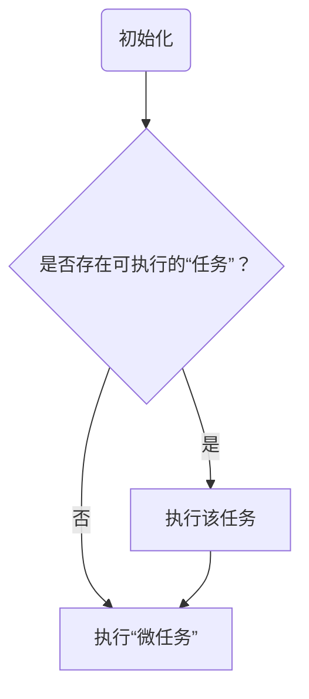

# Event Loop

## 浏览器

### 定义

**event loop对象结构：**

- running task
- microtask queue
- performing a microtask checkpoint
- last render opportunity time
- last idle period start time
- oldestTask
- taskStartTime
- hasARenderingOpportunity
- now

**任务类型：**

- Events 事件
- Parsing HTML语法解析
- Callbacks 执行回调函数
- Using a resource 使用资源
- Reacting to DOM manipulation 响应DOM操作

**任务对象结构：**

- Steps 表示任务的一系列步骤
- A source 表示任务来源
- A document `Document`对象（如果非`window event loop`，则是`null`）
- A script evaluation environment settings object set 脚本执行环境的一系列`settings object`

### 任务进队

TODO

### 执行模型

1. 设置`oldestTask`和`taskStartTime`为`null`
2. 是否存在可执行的”任务“
3. 执行”微任务“环节
4. 设置`hasARenderingOpportunity`为`false`
5. 设置`now`为当前时间
6. 检查`oldestTask`是否为`null`，报告“长任务”
7. 执行渲染（如果是 window event loop ）
8. 任务X

### 流程图

## 执行模型——Node.js

**多个阶段：**

- timers
- pending callback
- idle, prepare
- poll
- check
- close callback
