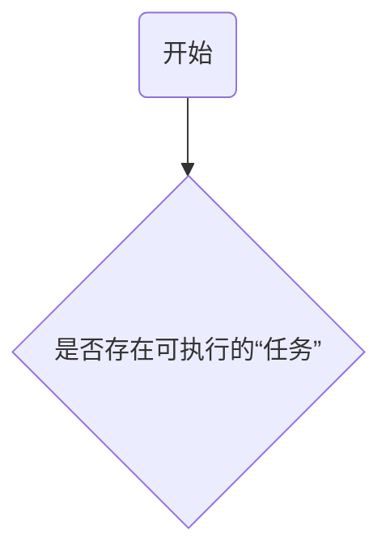

# Event Loop

## 执行模型——浏览器

1. 设置`oldestTask`和`taskStartTime`为`null`
2. 是否存在可执行的”任务“
3. 执行”微任务“环节
4. 设置`hasARenderingOpportunity`为`false`
5. 设置`now`为当前时间
6. 检查`oldestTask`是否为`null`
7. 执行渲染（如果是 window event loop ）
8. 任务X

### 流程图

## 执行模型——Node.js

**多个阶段：**

- timers
- pending callback
- idle, prepare
- poll
- check
- close callback
